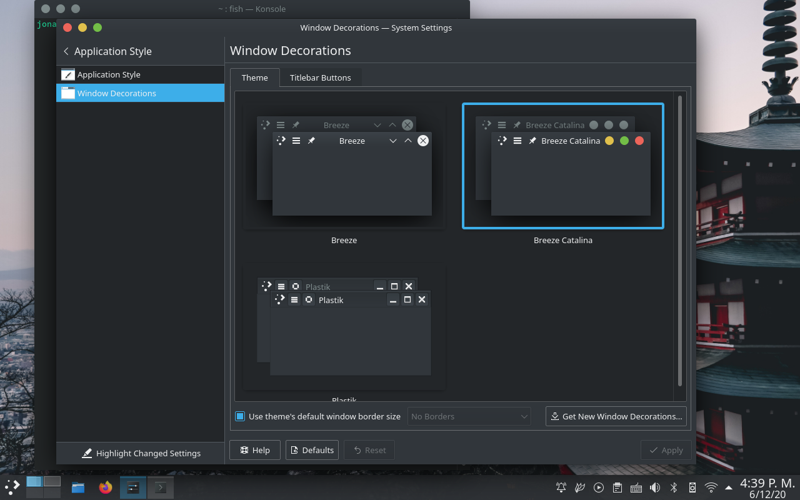

# Breeze Catalina

Fork of [Breeze](https://github.com/KDE/breeze)'s window decoration with macOS Catalina-like close, maximize and minimize buttons.

I'm very picky with themes and didn't like other macOS-like window decorations I found for Plasma, so I rolled my own. Only the close, maximize and minimize buttons are themed, and the other buttons should be intact (and would probably look weird next to the themed ones).

Theme settings are intact too, except for the option to disable the outline around the close button (which doesn't make sense anymore). The optional title bar gradient is also slightly lighter.

Keep in mind that this is, essentially, a patch, and the code could probably be better. Feel free to open issues and pull requests.

Thanks to [this post](https://zren.github.io/2017/07/08/patching-breeze-window-decorations) by Chris Holland for instructions on patching the window decorations.



## Build instructions (Ubuntu or Ubuntu-based distributions)

### Dependencies
- `build-essential`
- `cmake`
- `extra-cmake-modules`
- `libkdecorations2-dev`
- `libkf5config-dev`
- `libkf5configwidgets-dev`
- `libkf5coreaddons-dev`
- `libkf5guiaddons-dev`
- `libkf5iconthemes-dev`
- `libkf5package-dev`
- `libkf5windowsystem-dev`
- `libqt5x11extras5-dev`
- `qtdeclarative5-dev`
- `gettext`

```sh
mdkir build
cd build
cmake .. -DCMAKE_INSTALL_PREFIX=/usr -DCMAKE_BUILD_TYPE=Release -DKDE_INSTALL_LIBDIR=lib -DBUILD_TESTING=OFF -DKDE_INSTALL_USE_QT_SYS_PATHS=ON
make
sudo make install
```